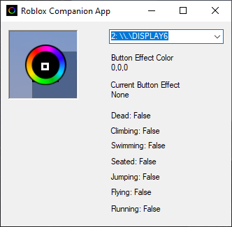

# Roblox Sample Chroma RGB Mod

This mod uses print statements and a companion app to monitor the game log and play Chroma RGB effects.


## Table of Contents

* [See Also](#see-also)
* [Quick Start](#quick-start)
* [Chroma Effects](#chroma-effects)
* [Videos](#videos)
* [Screenshots](#screenshots)
* [Scripts](#scripts)
* [Support](#support)


## See Also

**Docs:**

- [Chroma Animation Guide](http://chroma.razer.com/ChromaGuide/) - Visual examples of the Chroma Animation API methods

**Mods:**

- [MinecraftChromaMod](https://github.com/tgraupmann/MinecraftChromaMod) - Minecraft Chroma RGB Mod

- [RobloxSampleChromaMod](https://github.com/tgraupmann/RobloxSampleChromaMod) - Roblox Sample Chroma RGB Mod

- [Cpp_RustChromaModClient](https://github.com/tgraupmann/Cpp_RustChromaModClient) - Rust Chroma RGB Mod Client


**Editors:**

- [Web Chroma Editor](https://chroma.razer.com/ChromaEditor/) - Create Chroma RGB Animations

- [Roblox Studio](https://www.roblox.com/create) - Create Roblox Mods

## Quick Start ##

1. Open [RobloxSampleChromaMod.rbxl](RobloxSampleChromaMod.rbxl) and edit in Roblox Studio and Hit Play!

2. or Play from the Web [https://www.roblox.com/games/6109972658/Chroma-RGB-in-Roblox](https://www.roblox.com/games/6109972658/Chroma-RGB-in-Roblox)

3. Install the mod from [Releases](https://github.com/tgraupmann/RobloxSampleChromaMod/releases/tag/1.0) and launch the mod

4. or Launch `WPF_RobloxChromaMod` (from Visual Studio right now) which monitors the game log and plays `Chroma RGB` for the various game events.


## Chroma Effects ##

* Climbing Effect

* Dead Effect

* Flying Effect

* Keyboard Hotkeys

* Idle Effect

* Jumping Effect

* Running Effect

* Seated Effect

* Swimming Effect


## Videos ##


**Chroma RGB in Roblox (Overview)**

<a target="_blank" href="https://youtu.be/AI5I4I07aW8"></a>


**Chroma RGB – Player State**

<a target="_blank" href="https://youtu.be/JkeKgwhZWbQ"></a>


**Create Chroma Animations with the [Web Chroma Editor](https://chroma.razer.com/ChromaEditor/)**

<a target="_blank" href="https://youtu.be/ZVX3DNW2gIM"></a>


**Roblox Mod - Add Running Animation**

<a target="_blank" href="https://youtu.be/KymVo2Tzx1g"></a>


## Screenshots ##

**Roblox**


**WPF_RobloxChromaMod**




## Scripts ##


**TextButton Script**

Notice that `LocalScript` is a child of the `TextButton` at: [StarterGui/ChromaGui/Frame/BtnEffect1/LocalScript.lua](StarterGui/ChromaGui/Frame/BtnEffect1/LocalScript.lua)


The script prints `ChromaRGB: BtnEffectN` to the log which is monitored to play the corresponding Chroma RGB effect.

Another way to relay button state is using a label background color that is sampled by the companion app.

```lua
function leftClick()
	print("ChromaRGB:", script.Parent.Name)
	_G.ChromaEffect = script.Parent.Name;
end

function rightClick()
	print("ChromaRGB:", script.Parent.Name)
	_G.ChromaEffect = script.Parent.Name;
end

script.Parent.MouseButton1Click:Connect(leftClick)
script.Parent.MouseButton2Click:Connect(rightClick)
```

**ButtonEffectTextLabel Script**

```lua
-- globals

-- button effects
_G.ChromaEffect = 0;

-- game state
_G.GameStateClimbing = false
_G.GameStateJumping = false
_G.GameStateFlying = false
_G.GameStateRunning = false
_G.GameStateSwimming = true
_G.GameStateSeated = false

_G.GameStateTextLabel = script.Parent

while wait(0.033) do
	
	-- button state
	red = 0
	if (_G.ChromaEffect == "BtnEffect1") then
		red = 1
	elseif (_G.ChromaEffect == "BtnEffect2") then
		red = 2
	elseif (_G.ChromaEffect == "BtnEffect3") then
		red = 3
	elseif (_G.ChromaEffect == "BtnEffect4") then
		red = 4
	elseif (_G.ChromaEffect == "BtnEffect5") then
		red = 5
	elseif (_G.ChromaEffect == "BtnEffect6") then
		red = 6
	elseif (_G.ChromaEffect == "BtnEffect7") then
		red = 7
	elseif (_G.ChromaEffect == "BtnEffect8") then
		red = 8
	elseif (_G.ChromaEffect == "BtnEffect9") then
		red = 9
	elseif (_G.ChromaEffect == "BtnEffect10") then
		red = 10
	elseif (_G.ChromaEffect == "BtnEffect11") then
		red = 11
	elseif (_G.ChromaEffect == "BtnEffect12") then
		red = 12
	elseif (_G.ChromaEffect == "BtnEffect13") then
		red = 13
	elseif (_G.ChromaEffect == "BtnEffect14") then
		red = 14
	elseif (_G.ChromaEffect == "BtnEffect15") then
		red = 15
	end
	
	-- game state
	green = 0
	if _G.GameStateDead then
		green = 1
	else
		if _G.GameStateClimbing then
			green = bit32.bor(green, 3)
		end
		if _G.GameStateJumping then
			green = bit32.bor(green, 7)
		end
		if _G.GameStateFlying then
			green = bit32.bor(green, 15)
		end
		if _G.GameStateRunning then
			green = bit32.bor(green, 37)
		end
		if _G.GameStateSwimming then
			green = bit32.bor(green, 63)
		end
		if _G.GameStateSeated then
			green = bit32.bor(green, 127)
		end
	end
	
	-- final color
	script.Parent.BackgroundColor3 = Color3.fromRGB(red, green, 0)
end
```


**Player State Script**

Print player state events so that Chroma can react to changes. [StarterPlayer/StarterCharacterScripts/LocalScript.lua](StarterPlayer/StarterCharacterScripts/LocalScript.lua)


```lua
local character = script.Parent

local humanoid = character:WaitForChild("Humanoid")

local tokenLength = 24 -- "Enum.HumanoidStateType."

-- listen to humanoid state
humanoid.StateChanged:Connect(function(oldState, newState)
	if (newState ~= nil and oldState ~= newState and newState ~= Enum.HumanoidStateType.None) then
		local state = tostring(newState);
		if (string.len(state) > tokenLength) then
			local strState = string.sub(state, tokenLength + 1)
			print ("ChromaRGB:", string.format("Player_%s", strState));
		end
	end
end)
```

Add player state to globals to show in the label background color.

```lua
			if (strState == "Dead") then
				_G.GameStateDead = true
				_G.GameStateClimbing = false
				_G.GameStateJumping = false
				_G.GameStateFlying = false
				_G.GameStateRunning = false
				_G.GameStateSwimming = false
				_G.GameStateSeated = false
			elseif strState == "Climbing" then
				_G.GameStateDead = false
				_G.GameStateClimbing = true
				_G.GameStateJumping = false
				_G.GameStateFlying = false
				_G.GameStateRunning = false
				_G.GameStateSwimming = false
				_G.GameStateSeated = false
			elseif strState == "Jumping" then
				_G.GameStateDead = false
				_G.GameStateClimbing = false
				_G.GameStateJumping = true
				_G.GameStateFlying = false
				_G.GameStateRunning = false
				_G.GameStateSwimming = false
				_G.GameStateSeated = false
			elseif strState == "Flying" then
				_G.GameStateDead = false
				_G.GameStateClimbing = false
				_G.GameStateJumping = false
				_G.GameStateFlying = true
				_G.GameStateRunning = false
				_G.GameStateSwimming = false
				_G.GameStateSeated = false
			elseif strState == "Landed" then
				_G.GameStateDead = false
				_G.GameStateClimbing = false
				_G.GameStateJumping = false
				_G.GameStateFlying = false
				_G.GameStateSwimming = false
				_G.GameStateSeated = false
			elseif strState == "Running" then
				_G.GameStateDead = false
				_G.GameStateClimbing = false
				--_G.GameStateJumping = false
				_G.GameStateFlying = false
				_G.GameStateRunning = true
				_G.GameStateSwimming = false
				_G.GameStateSeated = false
			elseif strState == "Seated" then
				_G.GameStateDead = false
				_G.GameStateClimbing = false
				_G.GameStateJumping = false
				_G.GameStateFlying = false
				_G.GameStateRunning = false
				_G.GameStateSwimming = false
				_G.GameStateSeated = true
			elseif strState == "Swimming" then
				_G.GameStateDead = false
				_G.GameStateClimbing = false
				_G.GameStateJumping = false
				_G.GameStateFlying = false
				_G.GameStateRunning = false
				_G.GameStateSwimming = true
				_G.GameStateSeated = false
			end
```


**WPF_RobloxChromaMod**

1. Open [WPF_RobloxChromaMod/WPF_RobloxChromaMod.sln](WPF_RobloxChromaMod/WPF_RobloxChromaMod.sln) with Visual Studio

2. [WPF_RobloxChromaMod/MainWindow.xaml.cs](WPF_RobloxChromaMod/MainWindow.xaml.cs) monitors the Roblox game logs and plays Chroma RGB effects for the game events


# Support

Support is available on Discord, you can reach me at `Tim Graupmann#0611`.
